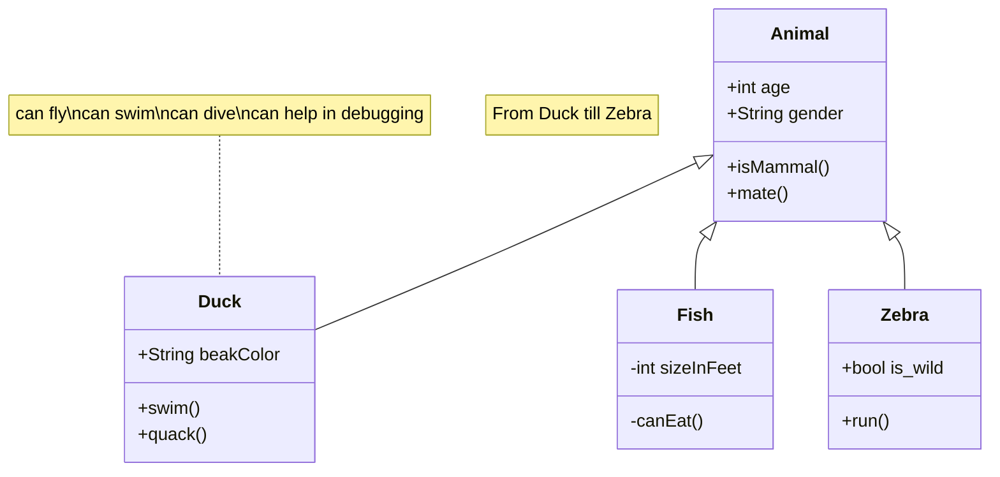

I'm a second-year undergraduate @ Purdue, pursuing a B.Sc in CompE.

My primary interest revolves arould building robust user-facing solutions at the intersection of explainable learning algorithms and interoperable systems. I enjoy research-driven environments aimed at taking concepts to tangible products. 

<b>Automatability</b>, <b>reproducibility</b> and <b>accessability</b> remain the core of my work. 

I'm currently looking to get involved in the following: 
- *Vision Generation Algorithms*, 
- *Robot-Environment Interactions*, 
- *GPU Programming*, 
- *Digital Design ↔️ ML/DL*. 

I'd highly appreciate any mentorship or suggestions for research labs @ Purdue that focus on these topics!

## background 



```echarts
{
  "title": {
    "text": "ECharts Getting Started Example"
  },
  "responsive": true,
  "tooltip": {},
  "legend": {
    "top": "30px",
    "data": ["sales"]
  },
  "xAxis": {
    "data": ["Shirts", "Cardigans", "Chiffons", "Pants", "Heels", "Socks"]
  },
  "yAxis": {},
  "series": [
    {
      "name": "sales",
      "type": "bar",
      "data": [5, 20, 36, 10, 10, 20]
    }
  ]
}
```

* F'23 - S'24: I'm worked at the [Duality Lab](https://davisjam.github.io/), where [we re-engineered](https://akshathraghav.github.io/projects/maskformer/) the MaskFormer segmentation from the [PyTorch-based artifact](https://github.com/facebookresearch/MaskFormer) to TensorFlow for publishing to the TF Model Garden. You can find our paper [here]() and code [here](https://github.com/PurdueDualityLab/tf-maskformer/tree/PR_Draft/models/official/projects/maskformer).
* S'24: I'm involved in MultiModal (LM) understanding projects at the [e-lab](https://e-lab.github.io/). I've built [eugenie](https://akshathraghav.github.io/projects/eugenie/) & [grammarflow](https://github.com/e-lab/SyntaxShaper/tree/main) and am working on encoding reading-order patterns within documents ([here's](https://drive.google.com/file/d/1x1IE_1NT-UAO7bFtoc_bPNJgqQFA1AXK/view?usp=sharing) my current plan of action)
* S'24: I led a project at the [CVES](https://yhlu.net/research.html) group @ Purdue ECE, where our goal was to define and evaluate reproducibility within AI/ML projects. I wrote the [codebase](https://github.com/AkshathRaghav/RAIS) for building our pipeline and statistically [defined](https://akshathraghav.github.io/projects/rais/) the importance of parameters. 
* S'23 - Summer'23: Worked at [Ambee](https://www.getambee.com/), where I deployed a worldwide [fire forecasting system](https://akshathraghav.github.io/projects/ambee/) into their API and wrote automated scripts for their environment-data focused [data lakes](https://www.getambee.com/api-documentation). You can find my **LOR** [here](https://akshathraghav.github.io/assets/pdf/AkshathRaghavR_LOR_Ambee.pdf). You can find the whitepaper [here](https://www.researchgate.net/publication/372769364_Time-Driven_Fire_Risk_Forecasting_Leveraging_Historical_Trends_for_Enhanced_Seasonal_Modeling). 
* F'22 - S'23: I helped lead a project that was supervised by Prof. [Yuan Wang](https://wang-lab.stanford.edu/people/yuan-wang) (currently at Stanford) where we aimed to correlate [lightning activity with wildfire spread](https://akshathraghav.github.io/projects/lwl/). I wrote (big-)data-interfacing code for satellites across EUR/EUS/SAR, and was responsible for packing them to use within a ConvLSTM model from [DeepCube's short-term forecasting](https://github.com/DeepCube-org/uc3-public-notebooks/blob/main/3_UC3_DL_models_XAI.ipynb).

## interests

I'm super excited about the [Partner as a Product (PaaP)](https://uxdesign.cc/this-is-the-moment-to-reinvent-your-product-1ee084e38ab1) era we're entering into. I hope to gain experience across the systems we're (going to) base our lives on, from hardware-level programming to cloud-based HA lifecycles. Majoring in ECE gives me the oppurtunity to develop myself in these areas. 

Going forward, I aim to specialize in the art of **solution-building**, by bridging happening research with dynamic market needs. My approach involves deep-diving into research to understand core principles thoroughly and then 'swimming' across to explore its applications, ensuring my projects are both **fundamentally robust and practically relevant**.

Lessons from my mentors: 
- *Reliable software is a by-product of a robust design process;*
- *Quality work is replicable, replicable work guarantees quality;*
- *If it's not use(d)(ful), what's the point of building it?*
- *Every unexplained idea in one field finds its explanation within another*

